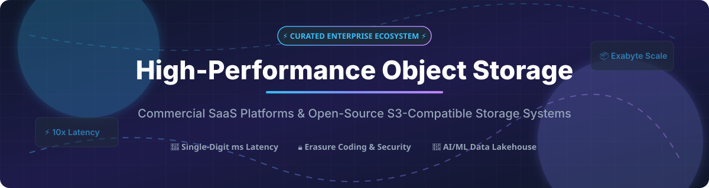

# Awesome-High-Performance-Object-Storage

# Awesome-High-Performance-Object-Storage ⚡ 📦



  





  
  
  
  
  
  



---

## 🌟 Top High-Performance Object Storage Ecosystem

**Curated List of Commercial Object Storage Platforms & Open-Source S3-Compatible Systems**  
*Focused on S3-Compatible APIs, Exabyte-Scale Storage, All-Flash Object Storage, AI/ML Data Pipelines, Multi-Cloud Portability & Self-Hosted Object Stores*

**Last updated: October 2026** 📅

---

### 📌 Overview & SEO Summary
Welcome to the ultimate curated directory of **high-performance object storage platforms**, **open-source S3-compatible systems**, and **exabyte-scale storage frameworks**. Whether you are looking for enterprise-grade commercial solutions (such as *Amazon S3 Express One Zone*, *VAST Data*, and *Pure Storage FlashBlade*), or self-hostable open-source alternatives (like *MinIO*, *Ceph*, and *SeaweedFS*), this list covers category leaders, S3 compatibility, and privacy-respecting object storage infrastructure.

**Key Market Context:**
- **Amazon S3 Express One Zone** is the **fastest cloud object storage**, delivering **single-digit millisecond latency** and **up to 10x faster performance** than S3 Standard — designed for **AI/ML training and latency-sensitive analytics**.
- **MinIO** is the **leading open-source object storage**, with **45K+ GitHub stars**, **S3 compatibility**, and **erasure coding, bit-rot protection, and encryption** — used by **70% of the Fortune 100**.
- **Ceph** powers the **majority of OpenStack deployments** with **RADOS Gateway S3 compatibility** and **exabyte-scale scalability**.

---

## 📑 Table of Contents
- [🏢 SaaS & Commercial Platforms](#-saas--commercial-platforms)
- [🔓 Open-Source GitHub Projects](#-open-source-github-projects)
- [🛠️ How to Contribute](#%EF%B8%8F-how-to-contribute)
- [📊 Star History](#-star-history)
- [🤝 Support & Sponsorship](#-support--sponsorship)
- [⚠️ Disclaimer](#%EF%B8%8F-disclaimer)

---

## 🏢 SaaS / Commercial Platforms

The high-performance object storage market spans **hyperscaler object storage services** (Amazon S3 Express One Zone, Cloudflare R2) that provide **single-digit millisecond latency with S3 compatibility**, **all-flash object storage platforms** (VAST Data, Pure Storage FlashBlade, Weka.io) that offer **exabyte-scale performance for AI/ML workloads**, and **enterprise object storage platforms** (Scality RING, NetApp StorageGRID) that provide **multi-protocol support and compliance**. **Amazon S3 Express One Zone** charges **$0.16/GB-month for storage** and **$0.0016/1,000 PUT requests** . **Cloudflare R2** charges **$0.015/GB-month with zero egress fees** . **Pure Storage FlashBlade//S** uses **custom enterprise pricing** . **Scality RING** uses **custom enterprise pricing** .

| SaaS / Commercial Platform | Company / Owner | Valuation / Market Cap | Standard Edition Starting Price | Free Tier / Free Trial Limits | Description |
| :--- | :--- | :--- | :--- | :--- | :--- |
| **[Amazon S3 Express One Zone](https://aws.amazon.com/s3/storage-classes/express-one-zone/)** ☁️ | Amazon | ~$2.0 Trillion | **$0.16/GB-month** (storage) + **$0.0016/1,000 PUT requests**  | **Free tier: limited** | **AWS-native high-performance object storage** — **Single-digit millisecond latency** . **Up to 10x faster than S3 Standard** . **Designed for AI/ML training and latency-sensitive analytics** . **S3-compatible API** . |
| **[MinIO Enterprise](https://min.io/)** 🎯 | MinIO | Private | **Custom enterprise pricing**  | **Free: MinIO Community Edition** | **Enterprise object storage** — **S3-compatible with erasure coding, bit-rot protection, and encryption** . **Used by 70% of the Fortune 100** . **The most widely deployed open-source object storage** . |
| **[VAST Data Universal Storage](https://www.vastdata.com/)** 🌊 | Vast Data | ~$9.1 Billion | **Custom enterprise pricing**  | **Demo available** | **Disaggregated storage architecture** — **All-flash, exabyte-scale** . **AI/ML and HPC optimization** . **S3-compatible object storage** . |
| **[Weka.io Object Storage](https://www.weka.io/)** ⚡ | WekaIO | Private | **$0.10/GB-month** (cloud) | **Free trial available** | **Software-defined parallel file system with S3** — **Hardware-agnostic** . **Scales to hundreds of petabytes** . **10s of millions of IOPS** . |
| **[Pure Storage FlashBlade//S](https://www.purestorage.com/)** 🟣 | Pure Storage | ~$15 Billion | **Custom enterprise pricing**  | **Demo available** | **Unified fast file and object storage** — **All-flash, NVMe architecture** . **Scales from 100TB to 10PB** . **>60 GB/s bandwidth** . **AI/ML-optimized** . |
| **[Cloudflare R2](https://www.cloudflare.com/developer-platform/r2/)** 🟠 | Cloudflare Inc. | ~$30 Billion | **$0.015/GB-month with zero egress fees**  | **Free: 10 GB storage, 1M operations/month**  | **Zero-egress object storage** — **S3-compatible with no egress fees** . **The most cost-effective cloud object storage** . |
| **[Scality RING](https://www.scality.com/)** 🏗️ | Scality | Private | **Custom enterprise pricing**  | **Free trial available** | **Software-defined object storage** — **S3-compatible** . **Scales to exabytes** . **Designed for cloud-native applications and data archiving** . |
| **[Ceph Cloud Storage (Commercial)](https://ceph.io/)** 🐙 | Red Hat (IBM) | ~$200 Billion (IBM) | **Red Hat Ceph Storage subscription**  | **Ceph OSS free forever**  | **Enterprise Ceph distribution** — **S3-compatible RADOS Gateway** . **The most widely deployed open-source object storage** . |
| **[Storj DCS](https://www.storj.io/)** 🌐 | Storj | Private | **$4/TB-month storage + $7/TB egress**  | **Free: 25 GB storage, 25 GB egress/month**  | **Decentralized cloud object storage** — **S3-compatible** . **Distributed across thousands of nodes** . **The most decentralized object storage** . |
| **[NetApp StorageGRID](https://www.netapp.com/)** 🔷 | NetApp | ~$20 Billion | **Custom enterprise pricing**  | **Demo available** | **Enterprise object storage** — **S3-compatible with multi-site replication** . **Compliance and governance** . **The most enterprise-ready object storage** . |

---

## 🔓 Open-Source GitHub Projects

*Sorted by GitHub_Stars_Count (Descending)* 🌟

- **[MinIO](https://github.com/minio/minio)**   
  **High-performance S3-compatible object storage**, AGPL-3.0 licensed. **45K+ GitHub stars** — **the leading open-source object storage** . **Erasure coding, bit-rot protection, and encryption** . **Single binary deployment** . **Used by 70% of the Fortune 100** . **The definitive open-source object storage platform** . 🎯

- **[Ceph](https://github.com/ceph/ceph)**   
  **Unified distributed storage system**, LGPL-2.1 / GPL-2.0 / BSD-3-Clause licensed. **14K+ GitHub stars** — **RADOS Gateway provides S3-compatible object storage** . **Erasure coding** for cost-efficient storage . **The dominant open-source storage platform** for cloud infrastructure and Kubernetes (via Rook) . 🐙

- **[SeaweedFS](https://github.com/seaweedfs/seaweedfs)**   
  **Fast distributed storage system for blobs, objects, files, and data lake**, Apache-2.0 licensed. **Millions of files** supported . **S3-compatible API** . **Cloud tiering to S3, GCS, and Azure** . **The most scalable open-source object store** . 🌿

- **[OpenIO](https://github.com/openio-sds/openio)**   
  **Distributed object storage software**, AGPL-3.0 licensed. **Modular architecture** adapting to different hardware types . **S3 API compatibility** . **Replication and automatic repair** . 🌐

- **[Garage](https://github.com/deuxfleurs/garage)**   
  **S3-compatible distributed object store for self-hosted deployments**, AGPL-3.0 licensed. **Lightweight and geo-distributed** . **Designed for small to medium-scale deployments** . **The most accessible self-hosted S3 alternative** . 🚗

- **[Zenko](https://github.com/scality/Zenko)**   
  **Multi-cloud data controller**, Apache-2.0 licensed. **Unified S3 API across multiple clouds** . **Cloud data management and replication** . **The standard for multi-cloud object storage** . 🔄

- **[Rook](https://github.com/rook/rook)**   
  **Storage orchestrator for Kubernetes**, Apache-2.0 licensed. **CNCF graduated project** . **Deploys and manages Ceph object storage on Kubernetes** . **The standard for Kubernetes object storage** . 🎛️

- **[OpenStack Swift](https://github.com/openstack/swift)**   
  **Distributed object storage**, Apache-2.0 licensed. **The original open-source object storage** . **S3-compatible with middleware** . **Used by OpenStack and Rackspace** . 🏛️

- **[LizardFS](https://github.com/lizardfs/lizardfs)**   
  **Open-source distributed file system with object storage**, GPL-3.0 licensed. **MooseFS fork** with additional features . 🦎

- **[MooseFS](https://github.com/moosefs/moosefs)**   
  **Petabyte-scale distributed file system**, GPL-3.0 licensed. **Fault-tolerant, highly performing, scalable network distributed storage** . 📦

- **[OpenZFS](https://github.com/openzfs/zfs)**   
  **Advanced file system and volume manager**, CDDL-1.0 licensed. **11K+ GitHub stars** — **data integrity, snapshots, and replication** . **The most robust open-source storage platform** . 🗄️

- **[DAOS](https://github.com/daos-stack/daos)**   
  **Exascale-class distributed storage stack**, Apache-2.0 licensed. **Intel-led** — **designed for next-generation HPC and AI workloads** with **NVMe and PMEM support** . 🔬

---

## 🛠️ How to Contribute

Contributions are welcome! Follow these steps to submit new object storage platforms or open-source S3-compatible software:

1. 🍴 **Fork** the repository.
2. 📝 **Add/edit** entries in `README.md` maintaining table/list structure and formatting.
3. 🔗 Include project title, official website/GitHub link, exact Stars_Count, license, and brief description.
4. 🚀 Submit a **Pull Request** with a descriptive summary of your changes.

---

## 📊 Star History



---

## 🤝 Support & Sponsorship

If you find this high-performance object storage repository useful, please consider supporting the project:

- ⭐ **Star** this repository to increase visibility!
- 🔀 **Fork** and share with fellow storage engineers, cloud architects, and open-source advocates.
- ☕ **Sponsor & Buy Me a Coffee**: Support ongoing open-source curation via the [GitHub Sponsor Dashboard](https://github.com/sponsors/ishandutta2007).

---

## ⚠️ Disclaimer

- This is a **community-curated** list — not exhaustive and not an endorsement. ℹ️
- **Amazon S3 Express One Zone is the fastest cloud object storage** — **$0.16/GB-month** and **$0.0016/1,000 PUT requests** . **Cloudflare R2 charges $0.015/GB-month with zero egress fees** .
- **MinIO is the leading open-source object storage** with **45K+ GitHub stars** and **used by 70% of the Fortune 100** . **Ceph provides RADOS Gateway S3 compatibility** and **powers the majority of OpenStack deployments** .
- **Open-source object storage platforms are not turnkey** — they require **deployment, erasure coding configuration, and ongoing maintenance** . **MinIO requires distributed cluster setup for production** . **Ceph requires MON, OSD, and RGW daemons** . **Always validate performance, durability, and S3 compatibility with a proof-of-concept** before production deployment . ⚡

---



  <b>Made with ❤️ for storage engineers, cloud architects, and open-source object storage advocates.</b>

